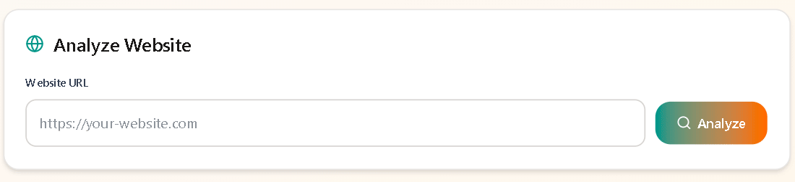
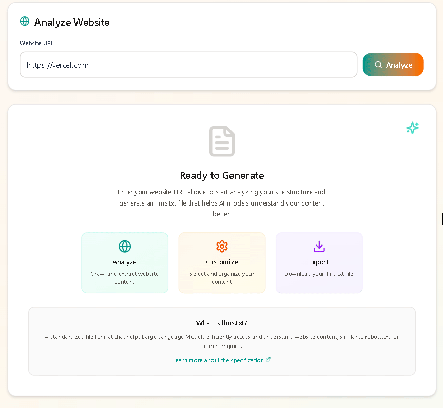
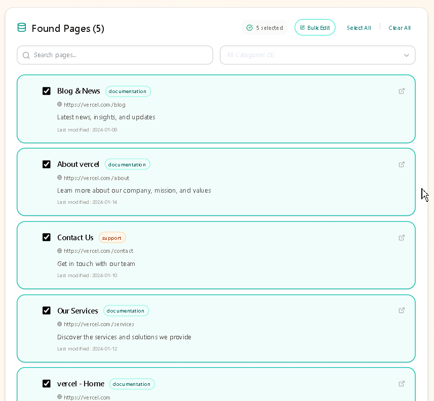
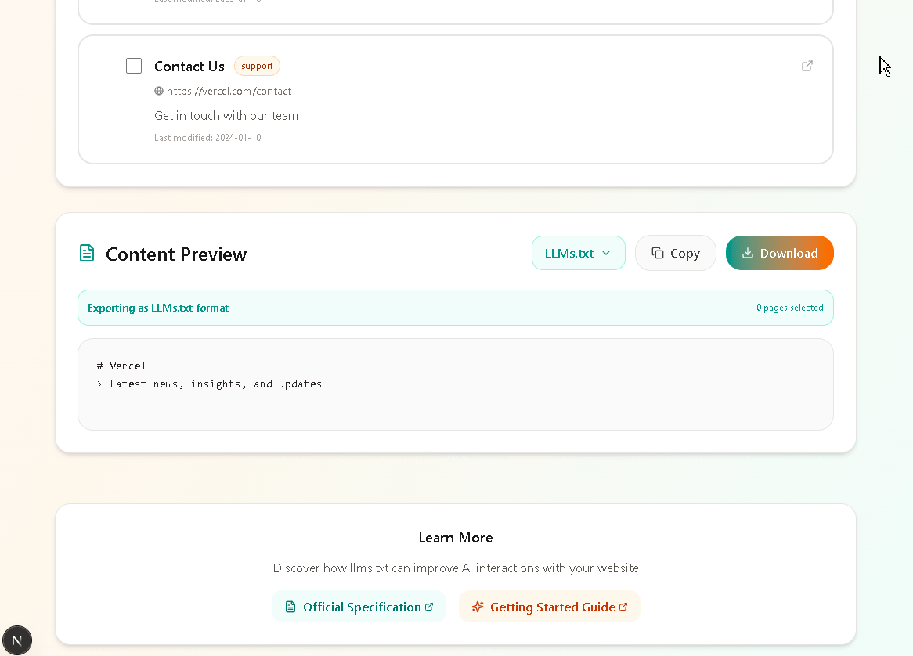
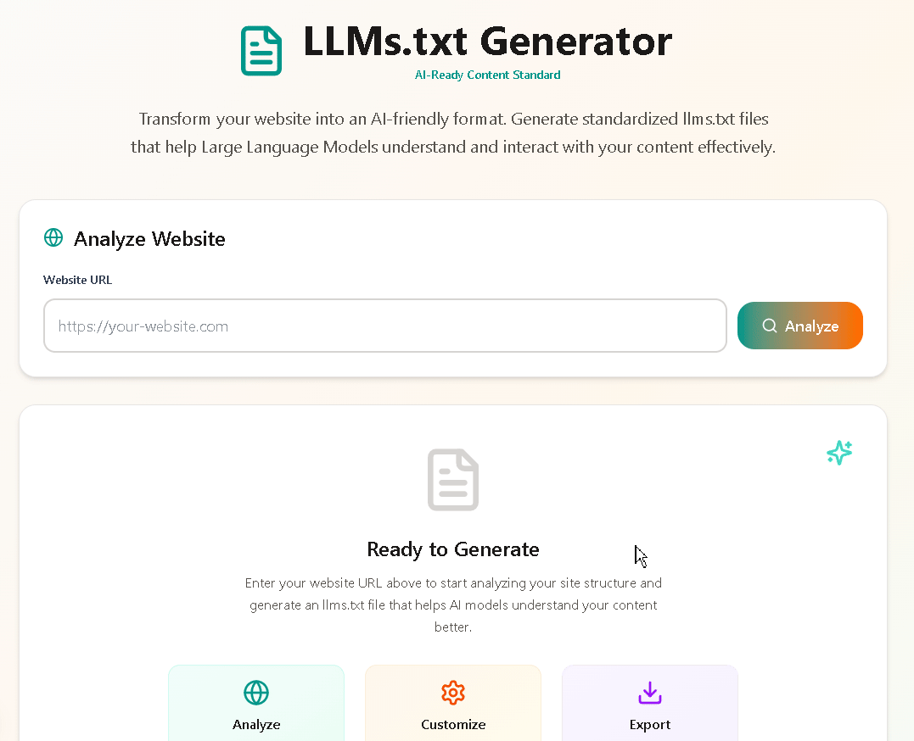

# LLMs.txt Generator

A web application that helps create llms.txt files for websites to improve AI/LLM compatibility. Built for Profound's Frontend Developer Task.

The website analysis currently uses smart mock data generation based on domain patterns (since I focused primarily on frontend architecture and abstracted the backend complexity), but the API structure is designed to easily integrate real web crawling services.

**Live Demo**: [live demo link](https://llms-txt-generator-demo.vercel.app)

## Tech Stack

- **Frontend**: React 19, Next.js 15, Tailwind CSS
- **Backend**: Next.js API Routes  
- **Icons**: Lucide React
- **Deployment**: Vercel

## Quick Start

### Requirements
- Node.js 18+ 
- npm

### Run Locally

```bash
# Clone the repo
git clone 
cd llms-txt-generator

# Install dependencies
npm install

# Start development server
npm run dev

# Open http://localhost:3000
```

### Build for Production

```bash
npm run build
npm start
```

## Key Features Demo


*Search Functionality with real-time form validation with error messages.*


*3-second guaranteed loading animation for consistency.*



*Bulk editing and category editing in action.*


*Drag-and-drop reordering and output; Toast notifications for feedback; Multiple Output formats with download and copy options.*


